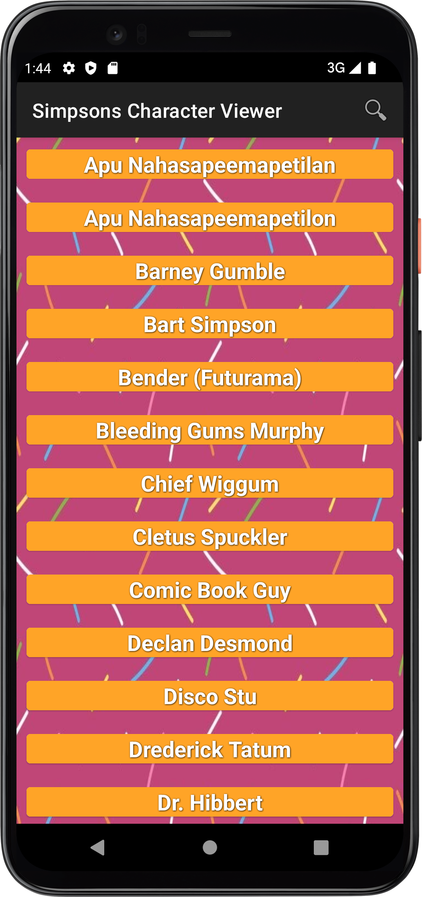
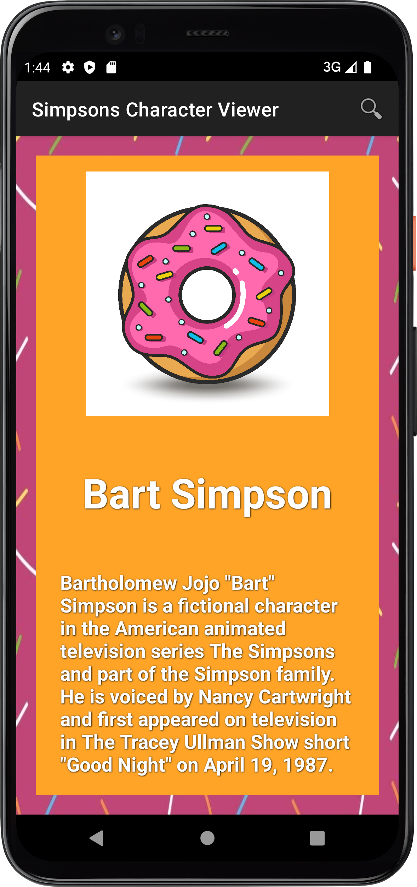
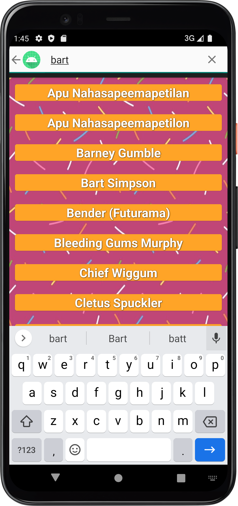
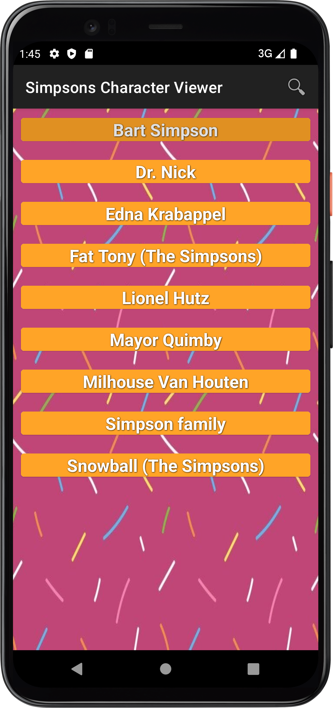
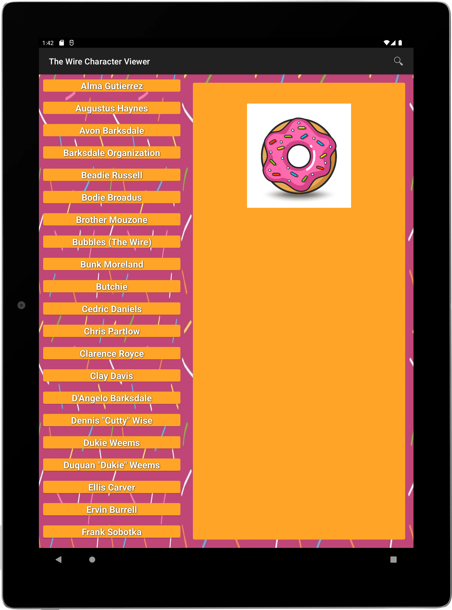
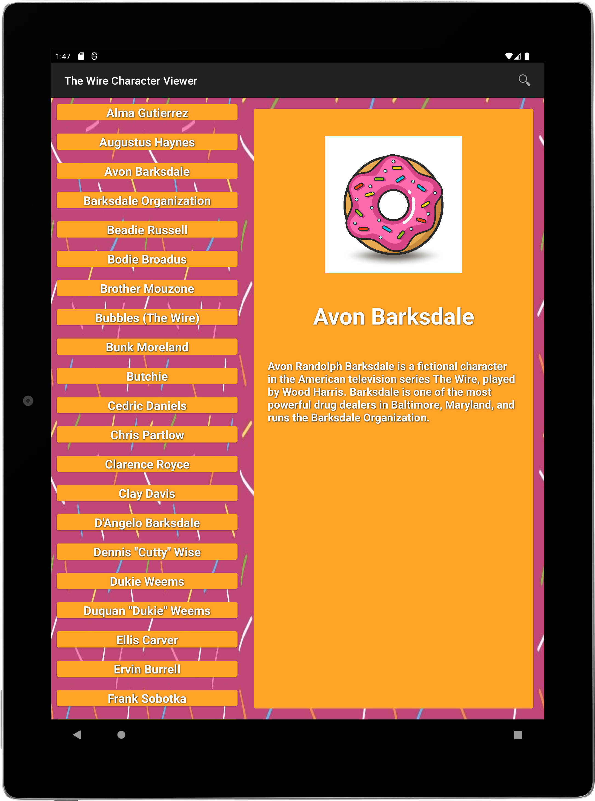
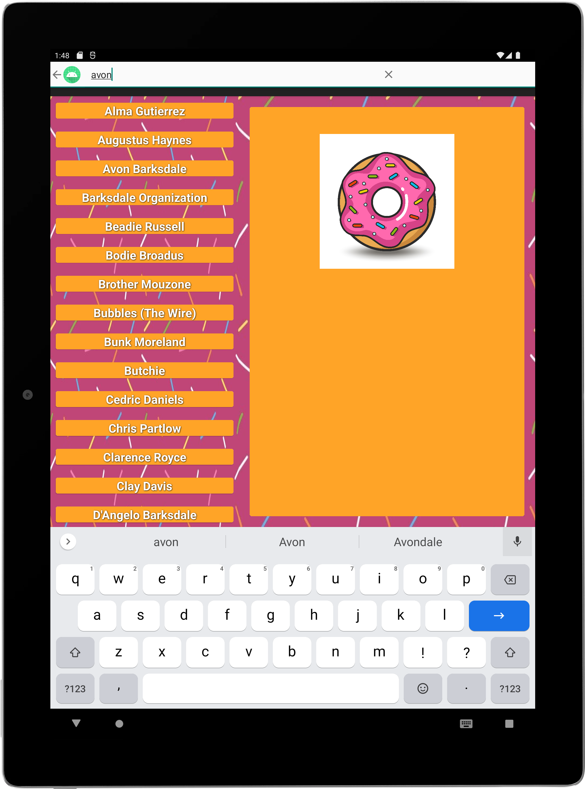
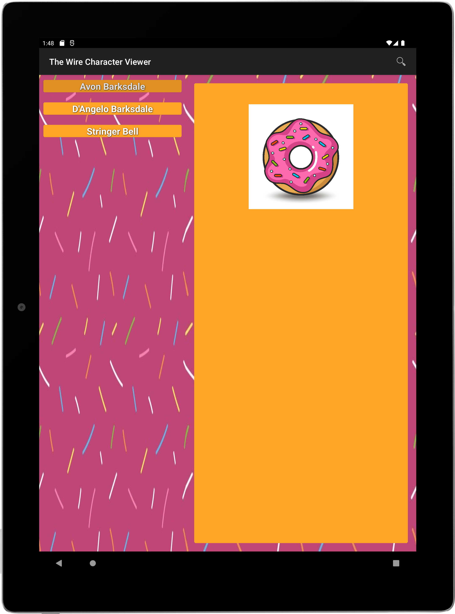

<h1 align="center">Doughnuts-Directory</h1>
<h4 align="center"> TV Character Index App</h4>

## Description
Built for a coding exercise, given by a potential client, this app is designed to ingest API JSON response data and display TV show characters for The Simpsons and The Wire. 

Written in [Kotlin](https://kotlinlang.org/) using [MVVM](https://medium.com/swlh/understanding-mvvm-architecture-in-android-aa66f7e1a70b) architecture with [ViewModels](https://developer.android.com/topic/libraries/architecture/viewmodel) and [LiveData](https://developer.android.com/topic/libraries/architecture/livedata), [Databinding](https://developer.android.com/topic/libraries/data-binding), [Fragments](https://developer.android.com/guide/fragments), [SlidingPaneLayout](https://developer.android.com/reference/androidx/slidingpanelayout/widget/SlidingPaneLayout), [Retrofit](https://square.github.io/retrofit/) consuming a [RESTful API](https://medium.com/android-news/consuming-rest-api-using-retrofit-library-in-android-ed47aef01ecb) and [Picasso](https://square.github.io/picasso/) for handling images. The App was written with best practices in mind.

## Awaiting Feedback On

According to instructions outlined in the coding exercise provided by the client, images are supposed to be used by calling the `Icon:{URL}` field in the JSON response data. The URL field returns an HTML element contained within the page, as opposed to the expected hosted image destination.
Currently I am using a placeholder image until the client responds with how they would like me to ingest the image. I have two ways I can achieve the desired result, but both are different from the expectations outlined by the client directions.

I could use [JSOUP](https://jsoup.org/) to parse and extract the elements, find the image, then call it back in the image loading process using Picasso when navigating to the DetailsView.

I could alternatively use a WebView container to load the website, download the URLs HTML data as a String, use a formatUtil to parse the data for the `Icon:{URL}` in the JSON response, and extract the element at the location contained within the website HTML.

Will update codebase with the requested method for loading the image when I heard back from the client.

## Client Requested Objectives

* Needed to be written in Kotlin
* Needed to be written using industry best practices and most up to date code paradigms
* Needed to be created with a production-ready minded development process
* Needed to write layouts in XML, as client is not using Jetpack Compose
* Needed to use provided RESTful API call to populate List and Detail views with JSON response data
* Needed two build variants: one for The Simpsons API call, and the other for The Wire API call
* Needed build variants to share the same codebase
* Needed to give each build variant a specific package name, detailing which API was being used
* Needed to have two App Names: one for The Simpsons package, and one for The Wire package
* Needed to digest both [The Simpsons](http://api.duckduckgo.com/?q=simpsons+characters&format=json) and [The Wire](http://api.duckduckgo.com/?q=the+wire+characters&format=json) RESTful API calls
* Needed a clickable object on character name in the List view that navigates to/shows the Details view
* Needed specific views for Phone: one screen for a scrolling list of character names, and one for a selected character's details and image
* Needed specific view for Tablet: one screen that contains a scrolling list of character names, and when clicked, their details and image
* Needed a List layout that contains only character names and is vertically scrollable
* Needed a Details layout that contains the selected character's name, description, and image
* Needed to implement Search on both Title and Description (Title and Description were populated from the RESTful API field titled `Text`)
* Needed to include a placeholder if there is an empty image URL (**none of the provided URLs were working at the time of build**)
* The layout design was left up to the developer. I chose a doughnut theme; you're welcome. :smiley::doughnut:

**Search parses both the Title and Description fields, hence multiple results**

**Search parses both the Title and Description fields, hence multiple results**

## Improvements
* Currently showing placeholder for all images as API response for URL fields is broken.
* Add a splash screen during app startup.
* Rework subsequent searches to parse through initial characters list, not parse through previous search results.
* Convert [XML](https://developer.android.com/develop/ui/views/layout/declaring-layout) to [Jetpack Compose](https://developer.android.com/jetpack/compose) after initial feedback from client. Client specifically requested to use XML as they are not currently using Jetpack Compose in their production apps.

## License
	Copyright 2023 Tyler OHearn
	
	Licensed under the Apache License, Version 2.0 (the "License");
	you may not use this file except in compliance with the License.
	You may obtain a copy of the License at
	
	   http://www.apache.org/licenses/LICENSE-2.0
	
	Unless required by applicable law or agreed to in writing, software
	distributed under the License is distributed on an "AS IS" BASIS,
	WITHOUT WARRANTIES OR CONDITIONS OF ANY KIND, either express or implied.
	See the License for the specific language governing permissions and
	limitations under the License.
